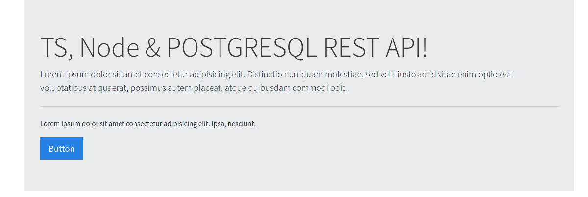

# TYPESCRIPT, NODEJS & POSTGRESQL REST API :rocket:

This is a rest api using TS, NODEJS, POSTGRESQL.

This api can create, update, delete and list users with a name and email.

## Technologies used for this project :computer:

- [typescript](https://www.typescriptlang.org/)
- [nodejs](https://nodejs.org/en/)
- [postgresql](https://www.postgresql.org/)

## Screenshots :camera:



## Hacking

> You can modified source code.

```cmd
git clone https://github.com/gabrielba15/typescript-nodejs-postgresql-restapi.git 
cd typescript-nodejs-postgresql-restapi
npm install 
npm run build 
npm start
```

> Ready, happy hacking :D
